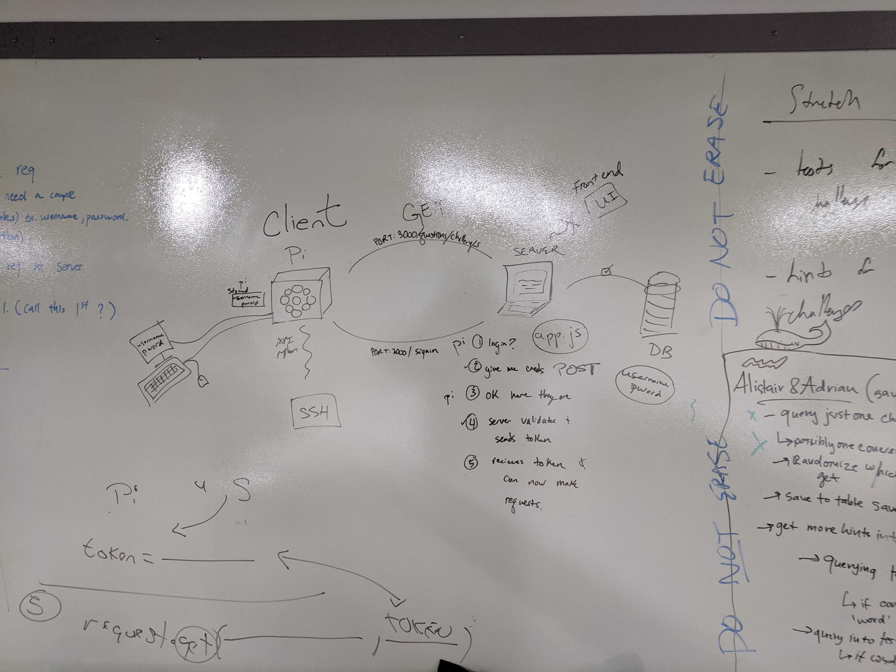
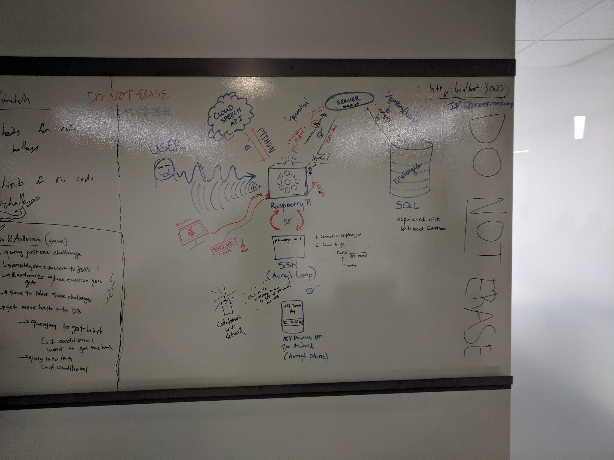

# SqueakBot
Javascript 401 Midterm Project - November 2019

--------------------------------------------------

### We are deployed on Heroku
https://squeak-bot.herokuapp.com/

### Github
https://github.com/SqueakBot/SqueakBot
https://github.com/SqueakBot/RaspPiPython

--------------------------------------------------
### run
`nodemon index.js`

--------------------------------------------------

## Squeakbot

Squeakbot is a helpful mock interviewer for the phase of your life when you are practicing common whiteboard questions 
in preparation for job interviews in the tech industry. It uses AI technology and a raspberry pi zero to listen to your 
request and output a question. When you ask it, "Give me a challenge," it will receive your request through a microphone
on a voice bonnet. Using a Node Server, it pulls a random question from a SQL database and reads it out loud to you through a speaker. 

Authors: Adrian Huebner, Julie Erlemeier, Alistair Blake, David Zheng, Avrey Brown

## User Stories

1. As a user at Code Fellows, I want a device to remind me what code challenges are available, so I can improve my skills.
2. As a developer of this app, I want to create a database, so that it can hold all the code challenges.
3. As a designer of the product, I want to make the product appealing, so the user can have an enjoyable experience.
4. As a developer of this app, I want the device to have the ability to play music, so the user can have that option while coding.
5. As an experienced developer, I want to check in to see the current code challenges in today’s world, so that I can improve my skills.

--------------------------------------------------

## Tools Used

VS Code
SSH
Google Voice Kit with Raspberry pi zero
AIY Project App (Android): allows developer to connect to raspberry pi through a wireless network connection by providing an IP address.
Google CloudSpeech API

- NodeJS
- ExpressJS
- PostgresQL database
- Google Cloud Speech API
- Hardware
  - Google Voice Kit
    - Raspberry pi zero
    - Voice bonnet
    - Speaker
  - Keyboard
  - Mouse
  - Monitor
  - MicroUSB to USB cable
  
---------------------------------

## Getting Started

Clone this repository to your local machine.
```
<!-- $ git clone https://github.com/SqueakBot/SqueakBot -->
```
Once downloaded, you can either use Visual Studio 2017 (or greater) to build the web application.
```
cd SqueakBot/SqueakBot
`npm i`
```
Install all dependencies needed for the project.
```
PostgresQL Database
* CREATE DATABASE squeakbot
* `psql -f <schema.sql> -d <squeakbot>`
* How this Database works:
  * There are three seperate tables in this database: User, Challenges, Test
    * User:
      * Every user has a serial primary id that is generated by postgres
      * When every user signs up, they are required to provide an username, email and password which are saved to the database
        * The password that is saved to the database is a hashed password
    * Challenges
      * Everything that is in the challenges table are inserted into the table within the schema file
        * The rows that are in the table are as follows:
          1. Challenges (Individual White Board Challenge)
          2. Data Type, this is the datatype that is being used for each challenge
          3. Hint, this is a hint for the user to have if they get stuck with whiteboard question
    * Test
      * Everything that is in the challenges table are inserted into the table within the schema file
        * The primary key for tests is the same as the primary key for challenges that way when a random challenge is generated the user can get the test for that challenge
        * Input Row
          * This row is what the users input should be for the whiteboard challenge that they get from SqueakBot
        * Output Row
          * This row is what the users output should be after they are done with their whiteboard challenges
```
Create a .env file
* Define a PORT
* Add your Database URL: DATABASE_URL=postgresql://localhost:5432/squeakbot
* For more details see section titled: 
```
cd SqueakBot/SqueakBot
`npm start ` OR `nodemon`
```
---------------------------

## Database Entity-Relationship-Diagram


---------------------------

## SQL DATABASE USAGE

### User Table

- id
  - type: String
  - key: Primary Key
- username
  - type: String
- email
  - type: String
- password
  - type: String

### Challanges

- id
  - type: String
  - key: Primary Key
- challanges
  - type: String
- hint
  - type: String

### Tests

- id
  - type: String
  - key: Primary Key
  - test and challenge have the same id number so that the user can get the test for the random challenge that was generated
- input
  - type: String
- output
  - type: String

--------------------------------------
## Data Flow (Frontend, Backend, REST API)
***[Add a clean and clear explanation of what the data flow is. Walk me through it.]***




## The Model

