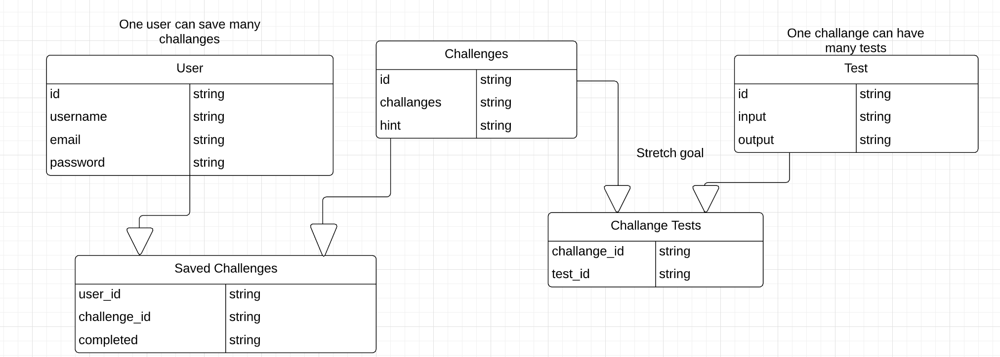

# SqueakBot

Midterm Project 401

## Authors: Adrian Huebner, Julie Erlemeier, Alistair Blake, David Zheng, Avrey Brown

## User Stories

1. As a user at Code Fellows, I want a device to remind me what code challenges are available, so I can improve my skills. 
2. As a developer of this app, I want to create a database, so that it can hold all the code challenges.
3. As a designer of the product, I want to make the product appealing, so the user can have an enjoyable experience. 
4. As a developer of this app, I want the device to have the ability to play music, so the user can have that option while coding. 
5. As an experienced developer, I want to check in to see the current code challenges in today’s world, so that I can improve my skills. 

## Database Entity-Relationship-Diagram

### User Table

- id
  - type: String
  - key: Primary Key
- username
  - type: String
- email
  - type: String
- password
  - type: String

### Challanges

- id
  - type: String
  - key: Primary Key
- challanges
  - type: String
- hint
  - type: String

### Saved Challanges

- 1 to Many relationship (One user can have many saved challanges)
- user_id
  - type: String
  - key: Foreign Key
- challenge_id
  - type: String
  - key: Foreign Key
- completed
  - type: String

### Challenges Tests

- 1 to Many (Challenge can have many tests)
- user_id
  - type: String
  - key: Foreign Key
- test_id
  - type: String
  - key: Foreign Key

### Tests

- id
  - type: String
  - key: Primary Key
- input
  - type: String
- output
  - type: String